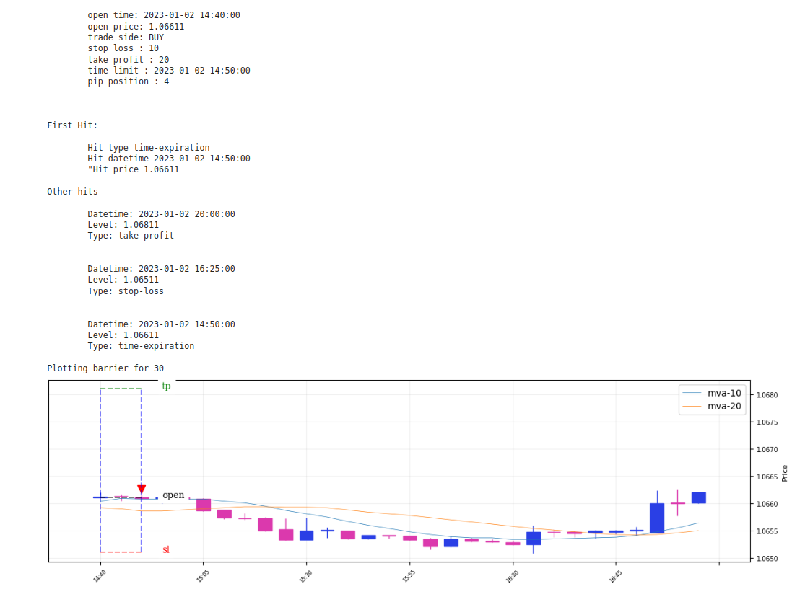

# WARNING:

This is a work in progress DO NOT USE IT FOR PRODUCTION PURPOSES

# Overview

Triple Barrier is a trade labeler that can be used for algorithmic trading back-testing or machine learning training and
validating pipelines. It records for each trade when, at what price level and why a position was closed.


It includes features to plot the triple for a particular trade and the closing event:


Other features:

- Built
  upon [pandas](https://pandas.pydata.org/), [numpy](https://numpy.org/), [matplotlib](https://matplotlib.org/) [mplfinance](https://github.com/matplotlib/mplfinance).
- It can be used to label single trades or semi vectorized, meaning that can be used with a pandas apply function.

## Why?

This project emerges from a repeated trading strategy back-testing process where I was caught again and again copying 
and pasting from previous pipelines the code to perform a vectorized (semi-vectorized to be more accurate) labeling of 
trades. To avoid this DRY (Do not Repeat Yourself) routine, that is why I decided to move this code to a library.

Before moving further into the library details a little bit of context.

### Trading Strategies

A trading strategy describes the logic for opening, managing and closing positions.

Depending on the trading strategy, once a position is opened, four events can determine how the position ends:

1. Stop loss hit: The price hit the stop loss, which is the maximum tolerable loss (Limit Order)
2. Take profit hit: The price hit the take profit, which is the estimated maximum profit the position can reach (Limit
   Order)
3. Expiration time reached: The position has reached a specific expiration time (Good Til Time or GTT orders)
4. A custom condition: Any custom condition that can trigger the position closing. These conditions depend on price
   action while the position is opened


To determine if a strategy is potentially profitable before live trading, it is necessary to collect a large sample of
trades to analyze the effectiveness of the strategy in terms of profits, mean profits, profits distributions, drawdowns
or any metric you prefer.

Doing this analysis process manually is not recommended at all, considering the amount of data you need to analyze, the
volume of trades required to determine if the strategy is significantly profitable and the human error, to name a few
reasons. 

## Algorithmic Trading and Triple Barrier

In simple terms, algorithmic trading is using software to automate all the processes described above: Open, manage
and Close trading positions.

But before running live a trading algorithm that implements a trading model you need to perform some research and
analyze the algorithm behavior on historic data to understand whether the algorithm is able to generalize well and
 behave similarly on unseen or future data, this process is called back-testing.

Is in back-testing where you need to identify: when positions were opened, when and why they were closed, so you can 
calculate all required performance metrics and that is why Triple Barrier was built for.


## How?

### How to install

```commandline
pip install triple-barrier==0.4.3rc0
```


[Triple barrier test](./tests/triple_barrier/integration/test_triple_barrier_apply_happy_path.py)

Or to this Jupyter Notebook that combines triple barrier calculation with plotting.

[Triple Barrier Jupyter Notebook](./docs/plot-method-tests.ipynb)


### How trade closing is calculated

The trade closing occurs when the first of the following events occur: price hits stop loss, take profit, dynamic barrier
or the time reaches the trade expiration date time. The event that occurs first is called the closing event.

The closing price is calculated as follows depending on the closing event.

**Stop Loss and Take Profit**: For these two cases, closing price is the one specified as a level or as a distance from 
opening price, which is internally transformed to a price level.

**Time barrier:** The closing price is the opening price for the period that starts at the expiration date time.

There is one exception for this case though, and it is the case when the number of periods for the trade expiration
exceeds the limit of the time series. In this case the last date of the time series will be used as time barrier. 

This situation will happen only for the last trade, so you can discard it in case you find this is not suitable for
your analysis.

**Dynamic Barrier**: The dynamic barrier is a condition that when reached, triggers the position closing. The condition
is evaluated at the closing of each period. In this case then, the closing price is the opening price of the period 
right next the one when the condition was evaluated as positive.


## Vectorized Trade Labeling

From version 0.5.6rc, trade labeling can be done vectorized, which means that you don’t need to take care 
of using the apply function, because a wrapper was built to deal with it so you just need to focus on 
producing strategy related data and the trade setup.

Below, one example of how the vectorization wrapper works.  

You can find more examples in the following jupyter notebook.

### Strategy

In this section is described how to implement a simple trading strategy that generates the inputs for triple_barrier.

- The calculations are performed on a OHLC time series.
- The price used is FOREX and for now the triple barrier is tested onbly on forex price.


The strategy is as follows:

1. Two moving averages are calculated: 10 periods ( called FAST ), the fast one, and 20 periods one (called SLOW) the slow one
2. A long signal is recorded for a bar after the closing if the following condition is met: FAST crosses above SLOW. More precisely:

$FAST_{t-1} < SLOW_{t-1} \land FAST_t > SLOW_t$

Where:

- $t-1$: period previous to the current closing
- $t$: current closing period

3. A short signal is recorded for a bar after the closing if the following condition is met FAST crosses below SLOW. More precisely:

$FAST_{t-1} > SLOW_{t-1} \land FAST_t < SLOW_t$

Where:

- $t-1$: period previous to the current closing
- $t$: current closing period

Notes

The entry period, when the position is opened, is the period right after the signal, the position open price is the open price for this bar.

Position opening price = $open_t$

For closing there will be a few cases that will be setup using the triple barrier and will be described in the caseses next. One of the closing cases is closing when the entry condition is not valid anymore and is described next.


4. Long closing: FAST < SLOW
5. Short closing: FAST > SLOW


For the sake of simplicity, strategy calculations will be omitted so you just need to know that a pandas dataframe 
contains the columns with the entry signal in the column: **long-entry**


The image above shows that the entry period (blue) is plotted with its corresponding entry signal (green), b
ut only the entry signal is relevant for the labeler and that is the column **long-entry**

The parameters for orders are the following:

Stop-loss width: 10
Take-profit width: 20
Trade periods: 2

```python
STOP_LOSS_WIDTH = 10
TAKE_PROFIT_WIDTH = 20
TRADE_PERIODS = 2
```

With all that data in place, to label the trades is as simple as the following instruction:

```python

from triple_barrier.trading import DataSetLabeler
from triple_barrier.trade_labeling import TradeSide
from triple_barrier.trading import TradingParameters

trade_params = TradingParameters(
    open_price=price.open,
    high_price=price.high,
    low_price=price.low,
    close_price=price.close,
    entry_mark=price["long-entry"],
    stop_loss_width=STOP_LOSS_WIDTH,
    take_profit_width=TAKE_PROFIT_WIDTH,
    trade_side=TradeSide.BUY,
    pip_decimal_position=PIP_DECIMAL_POSITION,
    time_barrier_periods=TRADE_PERIODS,
    dynamic_exit=None
)

dataset_labeler = DataSetLabeler(trade_params)
trades: pd.DataFrame = dataset_labeler.compute()

trades.head()

```


Profit in pips (FOREX)


Eventually, you may want to check one single trade to verify results. To do so you can plot it as follows:

```python

from triple_barrier.plots import PlotTripleBarrier
from triple_barrier.trade_labeling import Labeler
from triple_barrier.orders import Orders

box_setup = Orders()

box_setup.open_time = "2023-01-02 14:40:00"  # first trade of the list
box_setup.open_price = price.loc[box_setup.open_time]["open"]
box_setup.take_profit_width = TAKE_PROFIT_WIDTH
box_setup.stop_loss_width = STOP_LOSS_WIDTH
box_setup.time_limit = price[box_setup.open_time:].index[TRADE_PERIODS]
box_setup.trade_side = TradeSide.BUY
box_setup.pip_decimal_position = PIP_DECIMAL_POSITION

print(box_setup)

trade_labeler = Labeler(open_price=price.open,
                               high_price=price.high,
                               low_price=price.low,
                               close_price=price.close,
                               box_setup=box_setup)
orders_hit = trade_labeler.compute()
print(orders_hit)

plot_tb = PlotTripleBarrier(price.open,
                           price.high,
                           price.low,
                           price.close,
                           4,
                           periods_to_plot=30,
                           overlay_features=[ price["mva-10"], price["mva-20"] ]
                           )

plot_tb.plot_multi_barrier(trade_labeler)

```



## TODO

This project is its final stages of testing, documentation and CLEANing.

Besides that, there are some identified tasks that need to be done before the first release.

- Add string representations for some classes
- Refactor list of barriers hits (OrderBoxHits.barriers) as dictionary, currently is a list which
is not much actionable.
- Plotting: Add possibility to plot oscillators in a panel below
- Add trailing stops


## Other Documentation

[Uml models](./docs/models.md)

# References

[Why numpy is fast](https://numpy.org/doc/stable/user/whatisnumpy.html#why-is-numpy-fast)
